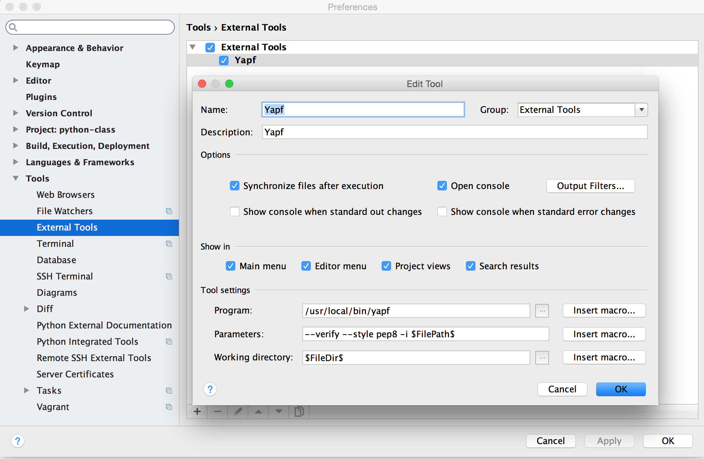

# YAPF简易安装配置指北

## YAPF安装

### 什么是YAPF
参考项目主页 https://github.com/google/yapf

### 为啥要用YAPF
个人认为有一下几个点
- 源自于google，由于google内部使用python较多，所以应该质量还是可以保证的
- 简单易用，一行命令搞定
- 跟多个编辑器都方便集成

### 安装
https://github.com/google/yapf#installation

## 和编辑器集成

### Atom
安装这个插件 https://atom.io/packages/python-yapf

在setting界面当中，设置好YAPF的路径。（mac或者linux，在terminal下使用which yapf查看yapf的路径）
"Yapf Style" 设置成 {based_on_style: pep8}

### sublime
从这个url下载最新的插件的package。如果是Mac，将下载的插件放入sublime的插件目录。如果是sublime2，
对应的修改shell中的路径名称。

url：https://github.com/GordonWang/PyYapf/blob/master/packages/PyYapf.sublime-package

```bash
cp PyYapf.sublime-package ~/Library/Application Support/Sublime Text 3/Installed Packages
```

将如下的设置填入Preference->Package Settings->PyYapf->Settings User
```json
{
      // full path and command to run yapf
      "yapf_command": "/usr/local/bin/yapf",

      "use_entire_file_if_no_selection": true,

      // add extra output to the console for debugging pyyapf/yapf behavior
      "debug": false,

      // if no encoding is specified use this.  utf-8 is a good choice,
      // ascii is (much) more restrictive.  Any of these should work:
      // https://docs.python.org/2/library/codecs.html#standard-encodings
      "default_encoding": "UTF-8",

      // yapf style options
      "config": {
            "based_on_style": "pep8",
      }
}
```

在sublime中，可以使用Command Palette,调用yapf来format文件。

### Vim

下载这个插件 https://github.com/GordonWang/vim-yapf/blob/master/ftplugin/python_yapf.vim

在.vimrc中加入如下的设置
```
let g:yapf_style = "pep8"
```
在vim中，使用 :Yapf  函数来format文件。

### PyCharm
Pycharm 支持external tool的设置。
按照如下的图片，设置一个名称为Yapf的external tool。



有了external tool之后，可以为这个external tool设置short cut。
